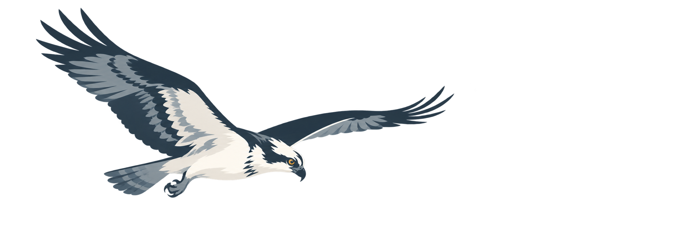

<p align="center">
  
</p>

<h1 align="center">Osprey</h1>

<p align="center">
  A dedicated G5 PTZ controller for better Frigate autotracking.
</p>

<p align="center">
  
  
  
</p>

Osprey exists to get the UniFi G5 PTZ out of Protect's disappointing built-in
tracking path and into Frigate. Protect can drive the camera, but its tracking
has not been reliable enough for real activity—especially when the subject is
moving quickly or crossing the frame. Frigate provides a local, inspectable
autotracking loop with better detection choices, event history, and tuning.

Osprey is the bridge that makes that practical: it gives your existing Frigate
instance an ONVIF/RTSP surface it can control, then gives you an operator
console to see what the camera is doing and recover gracefully when it cannot
keep up.

> [!WARNING]
> Osprey is alpha software. Keep it on a trusted LAN, do not forward its ports
> through a router, and supervise physical camera setup.

## Why Frigate instead of Protect tracking

Protect remains useful for camera management, but it is not the tracking system
Osprey is built around. Frigate owns detection, object history, zones, recording,
and the decision to move. Osprey translates those decisions into careful G5 PTZ
commands, waits for real motor state, and exposes the result to the operator.

That separation matters: a track can be measured, tuned, replayed, and rejected
when its timing is wrong instead of looking convincing only in a short demo.

## Clear product boundary

Osprey is a controller, not an NVR. It **does not install, package, configure,
or operate Frigate**. Bring an existing Frigate installation—on the same LAN,
a separate host, or Home Assistant—and point it at Osprey's ONVIF and RTSP
endpoints. You keep ownership of your detectors, recordings, retention,
storage, updates, and Frigate configuration.

| See clearly | Move deliberately | Stay in control |
| --- | --- | --- |
| Live browser preview, stream health, frame rate, and bandwidth at a glance. | Coarse or fine pan/tilt steps, a 0–100% zoom target, Home, and named positions. | Local video, local control, explicit failures, and no cloud account requirement. |

## What works today

- **Operator console** — live preview with snapshot fallback, PTZ controls,
  telemetry, zoom, codec controls, Home, and named positions.
- **Frigate connection** — a configurable Frigate base URL and ONVIF/RTSP
  endpoints for an existing Frigate installation to use for PTZ autotracking.
- **Distance-aware zoom** — conservative absolute zoom avoids the rapid
  oscillation seen in early relative-zoom testing.
- **Control safety** — shared movement arbitration rejects competing manual,
  MQTT, sentry, and tracking commands instead of letting sources fight over a
  camera.
- **Home Assistant direction** — an alpha add-on scaffold is included for
  contributors and early testers.
- **Multi-camera and MQTT** — controller-scoped camera registration plus
  configurable MQTT commands and camera-control events are in active work.

## What we are finishing next

| In progress | Why it matters |
| --- | --- |
| Fast-vehicle acceptance | A camera should not chase where a car used to be. Osprey is validating timing before claiming that result. |
| Sentry patrol | Rotate through saved views only while tracking is idle, without competing with a tracked subject. |
| Home Assistant release | Publish and validate add-on images before asking anyone to install from the add-on store. |
| Authentication and roles | Required before Osprey can safely become a shared or remotely reachable service. |

## Get started

Osprey currently runs from this repository with Docker Compose.

```bash
git clone https://github.com/grayslawson/osprey.git
cd osprey
docker compose build osprey
docker compose up -d --wait --wait-timeout 120 osprey
```

When the verification step completes, open the local operator page:

```text
http://127.0.0.1:18000/
```

The supported path today is Linux amd64 with Docker Compose. Rootless Podman
works for the local development path. Windows with Docker Desktop is supported
for local development; physical camera networking needs the Windows relay path.
Apple Silicon and other architectures have not been validated yet.

## Connect your Frigate installation

In **Settings → Frigate**, enter the base URL of the Frigate you already
operate—for example `http://frigate.local:5000` or
`http://192.168.1.40:5000`. Osprey uses it for integration health and
convenient operator links; it never starts, upgrades, or rewrites Frigate.

Then add Osprey as the camera's ONVIF/RTSP source in your own Frigate config
and enable Frigate autotracking. Your detector, object, zone, recording,
zoom-mode, and retention choices remain entirely in Frigate.

```yaml
# Your existing Frigate configuration — illustrative only.
cameras:
  g5_ptz:
    onvif:
      host: osprey.local
      port: 8000
    ffmpeg:
      inputs:
        - path: rtsp://osprey.local:8554/video2
          roles: [detect, record]
```

## Home Assistant

The add-on source is in [homeassistant/](homeassistant/README.md). It uses Home
Assistant ingress for the console and host networking for camera callbacks.
It is not yet a store-ready add-on: published images and validation on supported
Home Assistant installations are still required.

## Privacy and safety

- Osprey is designed to keep video and control traffic on your network.
- Do not commit camera addresses, MAC addresses, passwords, API keys, or video
  clips. Use the provided example configuration as a template only.
- Do not reset, unmanage, or re-adopt a working camera as a routine setup step.
- Back up Frigate configuration and reviewed movement settings before changing
  versions or recalibrating the camera.

## Built on Cuckoo and Finch

Osprey is built on the work of the original
[Cuckoo](https://github.com/rjmotion/cuckoo),
[Finch](https://github.com/rjmotion/finch), and
[pyunifiwire](https://github.com/rjmotion/pyunifiwire) authors and contributors.
Their camera protocol and runtime work is the foundation of this project.

## Contributing

Osprey is early and practical feedback is valuable. Please include the Osprey
version, host platform, camera model, Frigate version, and a redacted log or
reproducible description when reporting an issue. Never include credentials,
private addresses, MAC addresses, or video from someone else's property.

## License

Osprey is available under the [MIT License](LICENSE). Upstream components keep
their own license notices.
