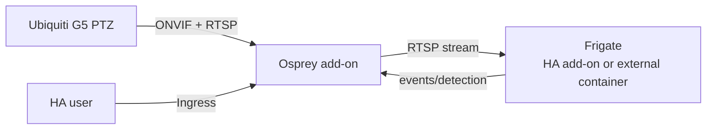

# Osprey Home Assistant add-on

Osprey bridges a Ubiquiti G5 PTZ camera to an existing Frigate installation
through ONVIF and RTSP. It does not bundle, install, or manage Frigate.

## Install

1. Open **Settings → Add-ons → Add-on store**.
2. Open the three-dot menu, choose **Repositories**, and add
   `https://github.com/grayslawson/osprey`.
3. Install **Osprey**, then set `advertised_host` to the Home Assistant host
   address reachable by the camera. Optionally set `camera_ip` and
   `camera_mac` as identity guards.
4. Start the add-on and use **Open Web UI** (Home Assistant ingress is enabled).

The manifest declares `amd64` and `aarch64`; each needs a matching GHCR image
before that architecture is supported. The public release still
requires the GitHub Actions image build, GHCR package, and Home Assistant
Builder validation to be enabled.

## Local build

The Dockerfile uses the repository root as its build context because it needs
both `cuckoo/` and `pyunifiwire/`:

```sh
docker build -f homeassistant/addon/osprey/Dockerfile -t osprey-addon:local .
```

Home Assistant OS does not build a sibling-source checkout automatically. A
local add-on copy must include those source trees, or use a prebuilt image.
Publish versioned images; do not use `latest` for production.

## Network and security

`host_network: true` lets the camera reach the advertised ONVIF, RTSP, and
callback addresses on the Home Assistant host. Restrict TCP 8000 and the
configured camera-facing ports with the host firewall or a dedicated VLAN.
Never forward them to the Internet.

The bridge currently has no independent authentication on direct LAN
endpoints. Home Assistant ingress protects access through the HA account, but
direct host-network ports remain trusted-LAN services. Independent Osprey
authentication is required before untrusted or remote deployment.

## Frigate and release checks

Configure the existing Frigate instance with the ONVIF endpoint and RTSP stream
shown by the Osprey operator UI. Keep recording and retention in Frigate. Test
zones, pan, tilt, zoom, tracking, and safe-stop before unattended tracking.

Before release, run the Home Assistant add-on builder for every declared
architecture and verify ingress, `/data` persistence, upgrade, and reinstall.

Built on [Cuckoo](https://github.com/rjmotion/cuckoo), originally published by
rjmotion and contributors.

## How the pieces connect

Osprey is the camera-facing adapter; Frigate remains the recorder and detector. They may
both be Supervisor add-ons, or Frigate may run in Docker on another host. Enter the Frigate
HTTP/API URL in the Osprey operator console; it does not need to share a Docker network.



### Frigate setup

Create the camera in Frigate using the RTSP URL and credentials shown by Osprey. For an HA
add-on use its Supervisor hostname/port (or host LAN address); for an external container
use its LAN DNS name/address. Do not use `localhost` unless both share a network namespace.
Keep retention, recording, detectors and zones configured in Frigate.

### Options, networking and security

`advertised_host` is mandatory: the HA host/LAN address used by camera callbacks and RTSP.
`camera_ip` and `camera_mac` are optional identity guards. `onvif_port` and `rtsp_port` must
be unused and reachable from the camera VLAN. The console is port 8000 through HA ingress;
host networking also publishes declared ports. Keep 7442/7444/7550 on the trusted LAN.

Ingress authenticates the console with Home Assistant, but direct host-network endpoints
are not independently authenticated. Firewall them to camera/Frigate VLANs, never
port-forward them, use a least-privilege HA account, and rotate camera credentials. A
deployment outside HA needs TLS and independent authentication.

### Release and validation

The repository root is the add-on repository (`repository.json` plus `addon/osprey/`). The
Dockerfile builds from root to copy `cuckoo/` and `pyunifiwire/`. Publish immutable
per-architecture GHCR images, update `version`, run `homeassistant/validate.sh` and the
Home Assistant Add-on Builder for every declared architecture. Test clean install/upgrade,
ingress, `/data` persistence, discovery, Frigate ingest, PTZ actions, tracking and safe-stop.
`docker build -f homeassistant/addon/osprey/Dockerfile .` is only a local smoke test.
